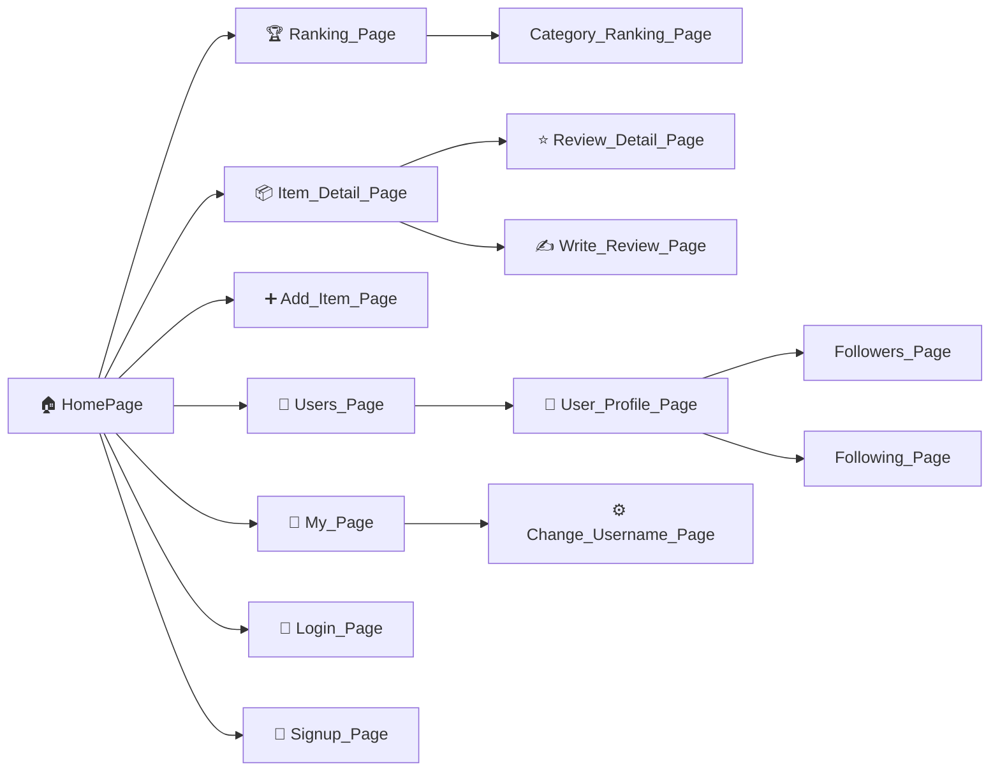
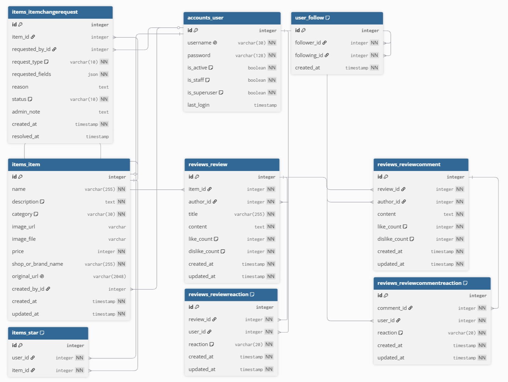

## 공통과제 I : 웹 기반 프로젝트 (2인 1팀)

**목적:** 공통 과제를 함께 수행하며 웹 개발의 전체 흐름을 빠르게 익히고 협업에 적응하기

**결과물:** 기획부터 배포까지 완료된 웹 서비스와 관련 문서 일체

---

## 팀원

| 이름 | GitHub | 역할 |
|------|--------|------|
|박채훈|chek737|-|
|이서영|sksy930|-|
|최재윤|Jaeyun-18|-|

---

## 기획안

> 프로젝트 주제, 목적, 핵심 기능, 예상 사용자, 팀원별 역할 등 정리

- **주제:**

아이템 추천 웹 서비스

- **목적:**

여러 commercial 서비스를 통합하여 나만 알기 아까운 꿀템들을 게시하고, 여러 사람들이 좋아한 아이템에 대한 정보를 쉽게 모아볼 수 있는 서비스를 개발하고자 한다. 

- **서비스 범위:**
  - 초기 MVP에서는 구매 가능한 실물 상품만 추천 대상으로 다룬다.
  - 예시는 화장품, 전자기기, 의류, 생활용품처럼 구매 사이트에서 확인할 수 있고 상품명, 이미지, 가격, 리뷰, 별점 등의 정보를 수집하거나 추출할 수 있는 아이템이다.
  - 디지털 콘텐츠, 장소, 음식점, 서비스 상품처럼 구매/상품 정보 구조가 다른 대상은 초기 범위에서 제외한다.

- **핵심 기능:**
  - 아이템 등록/탐색: 유저가 상품 URL과 구매 사이트 스크린샷을 입력하면 AI가 상품 정보를 인식해 등록
  - 꿀템 랭킹: 아이템 자체의 추천 수와 비추천 수를 기반으로 인기 아이템 정렬
  - 리뷰/평가: 아이템에 대한 추천 이유, 리뷰 본문, 좋아요/싫어요, 댓글 제공
  - 수정/삭제 요청: 사용자가 아이템 정보 수정 또는 삭제를 요청하고 Admin이 승인/거절

- **예상 사용자:**
  - 웹 검색을 할 수 있고 특정 카테고리에서 어떤 아이템이 좋을지 알아보고 싶은 사람
  - 여러 SNS를 돌아다니며 추천 콘텐츠를 찾는 데 피로를 느끼는 사람
  - 특정 분야에 신뢰하는 인플루언서/유저의 추천을 따라가고 싶은 사람

## 기능 명세서

### 필수 기능

- [ ] 회원가입 / 로그인
  - 초기 MVP에서는 이메일 없이 username, 비밀번호, 닉네임으로 가입한다.
  - 이메일 기반 비밀번호 찾기와 알림 기능은 초기 MVP에서 제외한다.
- [ ] 아이템 등록 및 리뷰 작성
  - 로그인한 일반 사용자는 누구나 아이템에 대한 리뷰를 작성할 수 있다.
  - 세상에 있는 모든 아이템을 미리 등록해두지 않는다.
  - 최초 유저가 어떤 상품에 대한 리뷰를 작성하면 해당 상품이 아이템으로 DB에 추가된다.
  - 이미 DB에 존재하는 아이템에 대해서는 다른 유저가 추가 리뷰를 작성할 수 있다.
  - 초기 MVP에서는 상품 URL과 구매 사이트 스크린샷을 함께 입력받는다.
  - 스크린샷을 기반으로 AI가 상품명, 대표 이미지, 가격, 쇼핑몰 또는 브랜드명, 원본 URL, 별점, 리뷰 수를 채우게 한다.
  - 사용자는 AI가 채운 상품 정보에 추천 이유와 리뷰 본문을 추가해 리뷰를 작성한다.
- [ ] 중복 아이템 후보 확인
  - URL은 상품 출처 기록과 중복 아이템 판별에 활용한다.
  - 원본 URL을 정규화했을 때 같으면 동일 상품 후보로 본다.
  - URL이 다르면 상품명 기준으로 기존 아이템 후보를 검색한다.
  - 상품명 후보 검색은 자동 확정이 아니라 사용자에게 "혹시 이 상품인가요?"로 보여주기 위한 용도로만 사용한다.
  - 사용자가 기존 아이템을 선택하면 해당 아이템에 리뷰를 추가하고, 아니라고 선택하면 새 아이템과 첫 리뷰를 생성한다.
- [ ] 꿀템 랭킹
  - 초기 MVP의 꿀템 랭킹은 복잡한 개인화 알고리즘 대신 아이템 자체의 추천 수 기반 정렬로 시작한다.
  - 기본 점수는 `아이템 추천 수 - 아이템 비추천 수`로 계산한다.
- [ ] 아이템 상세 및 리뷰 목록
  - 아이템 상세 화면에는 상품 정보, 원본 URL 이동 버튼, 추천/비추천 수, 리뷰 목록을 보여준다.
  - 아이템 상세 화면 안에서 리뷰 목록은 `리뷰 좋아요 수 - 리뷰 싫어요 수` 기반으로 정렬한다.
  - 좋아요를 많이 받은 리뷰는 상단에 노출되고, 광고성 리뷰나 공감받지 못한 리뷰는 자연스럽게 아래로 내려간다.
- [ ] 리뷰 댓글
  - 다른 유저들은 각 리뷰에 댓글을 남길 수 있다.
  - 댓글은 리뷰 글에 대한 의견, 사용 경험, 반박, 추가 정보를 담는다.
  - 한 유저는 같은 리뷰에 댓글을 여러 개 작성할 수 있다.
  - 작성자는 자신의 댓글을 수정하거나 삭제할 수 있다.
- [ ] 리뷰 좋아요 / 싫어요
  - 좋아요/싫어요의 대상은 개별 리뷰다.
  - 리뷰 좋아요/싫어요는 해당 아이템 상세 화면의 리뷰 정렬에 반영한다.
  - 한 사용자는 한 리뷰에 대해 좋아요 또는 싫어요 중 하나만 선택할 수 있다.
  - 사용자는 자신의 반응을 좋아요에서 싫어요로, 싫어요에서 좋아요로 변경할 수 있다.
  - 같은 반응을 다시 누르면 반응을 취소할 수 있다.
- [ ] 아이템 추천 / 비추천
  - 추천/비추천의 대상은 아이템 자체다.
  - 아이템 추천/비추천은 이 아이템이 진짜 꿀템인지 정량적으로 나타내는 지표다.
  - 아이템 추천/비추천은 꿀템 랭킹 점수에 반영한다.
  - 한 사용자는 한 아이템에 대해 추천 또는 비추천 중 하나만 선택할 수 있다.
  - 사용자는 자신의 반응을 추천에서 비추천으로, 비추천에서 추천으로 변경할 수 있다.
  - 같은 반응을 다시 누르면 반응을 취소할 수 있다.
- [ ] 아이템 수정/삭제 요청
  - 사용자는 아이템의 상품 정보를 직접 수정하거나 삭제할 수 없다.
  - 사용자는 수정 요청 또는 삭제 요청을 보낼 수 있다.
  - 실제 수정/삭제 반영 여부는 Admin이 승인하거나 거절한다.
- [ ] Admin 관리
  - 초기 MVP에서는 별도 React 관리자 화면을 만들지 않고 Django admin을 사용한다.
  - Admin은 Django admin에서 아이템, 리뷰, 댓글, 수정 요청, 삭제 요청을 확인한다.
  - 수정/삭제 요청은 Django admin에서 승인 또는 거절한다.

### 선택 기능

- [ ] 팔로우
  - 특정 카테고리에서 영향력 있는 유저를 팔로우해 추천을 지속적으로 받아보는 기능이다.
  - 초기 MVP에서는 제외하고, 이후 개인화 추천이나 소셜 기능을 추가할 때 다시 검토한다.
- [ ] 유명 유저 추천 가중치
  - 초기 MVP에서는 제외한다.
  - 데이터가 충분히 쌓인 뒤 꿀템 랭킹 개선 기능으로 확장한다.
- [ ] 팔로우한 유저 추천 가중치
  - 초기 MVP에서는 제외한다.
  - 팔로우 기능이 도입된 뒤 개인화 추천에 반영한다.
- [ ] 개인화 추천 알고리즘
  - 초기 MVP에서는 제외한다.
  - 사용자 행동 데이터가 충분히 쌓인 뒤 별도 기능으로 확장한다.
- [ ] 브랜드/쇼핑몰명 유사도 기반 자동 중복 판별
  - 초기 MVP에서는 제외한다.
  - 상품명 후보 검색과 사용자 확인 흐름을 먼저 사용한다.

---

## IA 및 화면 설계서

> 서비스의 전체 페이지 구조와 페이지 간 이동 흐름; 각 페이지의 주요 UI 구성, 입력 요소, 버튼, 사용자 행동 흐름 등을 간단한 와이어프레임 형태로 정리

## Information Architecture (IA)


Admin 화면은 React로 별도 구현하지 않고 Django admin을 사용한다.

## 화면 설계서
<p align="center">
  
  
</p>

<p align="center">
  
  
</p>

---

## DB 스키마

### E-R Diagram



---

## API 문서

> API 주소, 요청 방식, 요청값, 응답값, 에러 상황을 정리

기본 prefix는 `/api/`이며, 인증이 필요한 API는 JWT `Authorization: Bearer <access_token>` 헤더를 사용한다.

### System

| Method | Endpoint | 설명 | 요청 | 응답 |
|---|---|---|---|---|
| GET | `/api/` | API 루트 | 없음 | 서비스 상태, 주요 엔드포인트 |
| GET | `/api/health/` | 헬스 체크 | 없음 | `{status, message}` |

### Accounts

| Method | Endpoint | 설명 | 요청 | 응답 |
|---|---|---|---|---|
| GET | `/api/accounts/` | 유저 목록 조회 | 없음 | `{users: [{id, username}]}` |
| GET | `/api/accounts/me/` | 내 정보 조회 | JWT 필요 | `{id, username}` |
| POST | `/api/accounts/signup/` | 회원가입 | `{username, password}` | `{message, user}` |
| POST | `/api/accounts/login/` | 로그인 | `{username, password}` | `{message, user, access, refresh}` |
| POST | `/api/accounts/logout/` | 로그아웃 | `{refresh}` + JWT | `{message}` |

### Items

| Method | Endpoint | 설명 | 요청 | 응답 |
|---|---|---|---|---|
| GET | `/api/items/` | 아이템 목록/검색 | `name`, `shop_or_brand_name`, `original_url`, `created_by` 쿼리 | 아이템 배열 |
| POST | `/api/items/` | 아이템 생성 | `name`, `description`, `category`, `price`, `shop_or_brand_name`, `original_url`, `image` + JWT | 생성된 아이템 |
| GET | `/api/items/{id}/` | 아이템 상세 | 없음 | 아이템 상세 |
| PATCH/PUT | `/api/items/{id}/` | 아이템 수정 | 수정 필드 | 수정된 아이템 |
| DELETE | `/api/items/{id}/` | 아이템 삭제 | 없음 | `204 No Content` |
| POST | `/api/items/duplicate-candidates/` | 중복 후보 탐색 | `{name, shop_or_brand_name?, original_url?, price?}` | `{has_duplicates, message, candidates}` |
| POST | `/api/items/extract-from-screenshot/` | 스크린샷 기반 상품 정보 추출 | `multipart/form-data`의 `screenshot` | `{name, category, shop_or_brand_name, price, price_text, cropped_image_url, confidence, warnings}` |
| GET | `/api/items/ranking/` | 별 수 기반 랭킹 | `limit`, `category`, `name` 쿼리 | `{count, limit, category, results}` |
| GET | `/api/items/categories/` | 카테고리 옵션 조회 | 없음 | `{results: [{value, label}]}` |
| GET | `/api/items/{id}/ranking-detail/` | 랭킹용 아이템 상세 | 없음 | 랭킹 직렬화 결과 |
| POST | `/api/items/{id}/star/` | 아이템 추천 토글 | JWT 필요 | `{detail}` |
| GET | `/api/items/star-summary/` | 전체 아이템 별 수 요약 | 선택적 JWT | `{results: [{id, starCount, isStarred}]}` |
| GET | `/api/items/{id}/star-summary/` | 개별 아이템 별 수 요약 | 선택적 JWT | `{id, starCount, isStarred}` |
| GET | `/api/items/users/{user_id}/stars/` | 특정 유저가 별 준 아이템 목록 | 없음 | `{results: [{itemId, itemName, category}]}` |
| POST | `/api/items/{id}/change-requests/` | 아이템 수정/삭제 요청 생성 | `{request_type, requested_fields?, reason}` + JWT | 변경 요청 객체 |
| GET | `/api/items/{id}/change-requests/mine/` | 내 대기중 요청 조회 | JWT 필요 | 변경 요청 객체 또는 `null` |
| DELETE | `/api/items/change-requests/{id}/` | 내 대기중 요청 취소 | JWT 필요 | `204 No Content` |

### Reviews

| Method | Endpoint | 설명 | 요청 | 응답 |
|---|---|---|---|---|
| GET | `/api/reviews/` | 리뷰 목록/검색 | `item_id`, `author_id`, `q`, `user_id` 쿼리 | 리뷰 배열 |
| POST | `/api/reviews/` | 리뷰 생성 | `{item, user_id?, title, content}` | 생성된 리뷰 |
| GET | `/api/reviews/{id}/` | 리뷰 상세 | `user_id` 선택 쿼리 | 리뷰 상세 |
| PATCH/PUT | `/api/reviews/{id}/` | 리뷰 수정 | `{user_id, title?, content?}` | 수정된 리뷰 |
| DELETE | `/api/reviews/{id}/` | 리뷰 삭제 | `{user_id}` | `204 No Content` |
| GET | `/api/reviews/{review_id}/comments/` | 댓글 목록 | `user_id` 선택 쿼리 | 댓글 배열 |
| POST | `/api/reviews/{review_id}/comments/` | 댓글 생성 | `{user_id, content}` | 생성된 댓글 |
| GET | `/api/reviews/comments/{comment_id}/` | 댓글 상세 | `user_id` 선택 쿼리 | 댓글 상세 |
| PATCH | `/api/reviews/comments/{comment_id}/` | 댓글 수정 | `{user_id, content}` | 수정된 댓글 |
| DELETE | `/api/reviews/comments/{comment_id}/` | 댓글 삭제 | `{user_id}` | `204 No Content` |
| POST | `/api/reviews/{review_id}/reaction/` | 리뷰 좋아요/싫어요 토글 | `{user_id, reaction}` | 갱신된 리뷰 |
| GET | `/api/reviews/{review_id}/reactions/` | 리뷰 반응 목록 | 없음 | 반응 배열 |
| POST | `/api/reviews/comments/{comment_id}/reaction/` | 댓글 좋아요/싫어요 토글 | `{user_id, reaction}` | 갱신된 댓글 |
| GET | `/api/reviews/comments/{comment_id}/reactions/` | 댓글 반응 목록 | 없음 | 반응 배열 |

`reaction` 값은 리뷰/댓글 모두 `like` 또는 `dislike`다. 같은 반응을 다시 보내면 취소되고, 다른 반응을 보내면 교체된다.

### Users / Follow

| Method | Endpoint | 설명 | 요청 | 응답 |
|---|---|---|---|---|
| GET | `/api/user/` | 유저 목록 조회 | 선택적 JWT | `{users: [{id, username}]}` |
| GET | `/api/user/{user_id}/` | 유저 프로필 조회 | 없음 | `{id, username}` |
| POST | `/api/user/{user_id}/follow/` | 팔로우 | JWT 필요 | `{detail}` |
| DELETE | `/api/user/{user_id}/follow/` | 언팔로우 | JWT 필요 | `204 No Content` |
| GET | `/api/user/{user_id}/followers/` | 팔로워 목록 | 없음 | `[{user: {id, username}, created_at}]` |
| GET | `/api/user/{user_id}/following/` | 팔로잉 목록 | 없음 | `[{user: {id, username}, created_at}]` |
| PATCH | `/api/user/{user_id}/transname/` | username 변경 | `{username}` + JWT | `{id, username, detail}` |

### Recommend

| Method | Endpoint | 설명 | 요청 | 응답 |
|---|---|---|---|---|
| GET | `/api/recommend/` | 팔로워/별 수 기반 추천 집계 | 없음 | `{results, top_user_items, by_category, category_top_items}` |

---

## 배포 결과물

> 접속 가능한 링크, 실행 방법, 주요 구현 내용

- **서비스 URL:**
https://ggultem.madcamp-kaist.org/

- **실행 방법:**

### Frontend

상세 실행 방법은 `frontend/README.md`를 참고합니다.

### Backend

상세 실행 방법은 `backend/README.md`를 참고합니다.

- **주요 구현 내용**

### 개발 환경 구조

```text
브라우저
  -> Vite dev server
  -> /api, /media 프록시
  -> Django runserver
```

- 프론트엔드는 Vite 개발 서버에서 실행하고, 브라우저는 우선 Vite에 접속한다.
- Vite가 `/api`, `/media` 요청만 Django로 프록시하므로, 프론트와 백엔드를 각각 독립적으로 개발하면서도 브라우저 입장에서는 같은 오리진처럼 다룰 수 있다.
- 이 구조를 쓰면 React HMR, 빠른 번들링, 프론트엔드 에러 확인은 Vite가 담당하고, API 개발과 Django admin, 미디어 처리는 Django가 담당하게 되어 개발 효율이 높다.

### 배포 환경 구조

```text
브라우저
  -> Nginx
  -> 정적 파일(frontend/dist) 서빙
  -> /api, /media 프록시
  -> gunicorn
  -> Django
```

- 배포 시에는 Vite dev server를 띄우지 않고 `frontend/dist` 빌드 결과물을 Nginx가 직접 서빙한다.
- API 요청은 Nginx가 `/api` 경로를 gunicorn 뒤의 Django 애플리케이션으로 전달한다.
- 이렇게 하면 브라우저는 하나의 도메인만 바라보고, 정적 리소스와 API를 같은 진입점에서 사용할 수 있다.

### 운영 도메인 전환 체크리스트

- Cloudflare DNS에서 `ggultem.madcamp-kaist.org` 레코드를 운영 서버로 연결한다.
- Cloudflare에서 해당 호스트의 TLS와 프록시 설정을 확인한다.
- Nginx `server_name`을 `ggultem.madcamp-kaist.org`로 맞춘다.
- 프론트엔드 정적 파일은 기존처럼 `frontend/dist`를 Nginx가 서빙한다.
- Django 운영 환경 변수에 `DJANGO_ALLOWED_HOSTS=ggultem.madcamp-kaist.org,...`를 포함한다.
- 필요 시 `DJANGO_CORS_ALLOWED_ORIGINS=https://ggultem.madcamp-kaist.org`를 설정한다.
- 필요 시 `DJANGO_CSRF_TRUSTED_ORIGINS=https://ggultem.madcamp-kaist.org`를 설정한다.
- 변경 후 `./deploy.sh --reload-nginx`로 재배포하고 헬스 체크를 확인한다.

운영용 Nginx 예시는 `deploy/ggultem.nginx.conf.example`에 정리되어 있다.

### 왜 이런 구조를 채택했는가

- 개발과 배포의 책임을 분리하기 좋다. 개발에서는 Vite가 빠른 프론트엔드 피드백을 제공하고, 배포에서는 Nginx가 안정적으로 정적 파일을 전달한다.
- Django가 정적 파일까지 모두 직접 처리하지 않아도 되므로 애플리케이션 서버는 API와 비즈니스 로직에 집중할 수 있다.
- 프론트엔드와 백엔드가 `/api` 기준으로 느슨하게 연결되어 있어서, 로컬 개발과 운영 배포에서 동일한 URL 규칙을 유지하기 쉽다.
- 추후 트래픽이 늘어나도 Nginx, gunicorn, Django 레이어를 역할별로 조정하기 쉽다.

### Nginx 리버스 프록시를 두는 이유

- 정적 파일 서빙 성능이 좋다. `dist` 산출물은 Nginx가 직접 응답하는 편이 gunicorn/Django보다 효율적이다.
- `/api`와 `/media` 요청을 Django로 안전하게 전달하는 단일 진입점 역할을 한다.
- 브라우저가 프론트엔드와 백엔드를 서로 다른 포트로 직접 호출하지 않아도 되므로 운영 환경에서 CORS, 인증 쿠키/헤더, URL 관리가 단순해진다.
- TLS 종료, 캐시 정책, 압축, 요청 크기 제한, 접근 로그 같은 운영 설정을 웹 서버 계층에서 일괄 관리할 수 있다.
- gunicorn 앞단에서 연결을 받아주기 때문에 Django 프로세스를 외부에 직접 노출하지 않아도 된다.


## 회고 문서

> 개발 과정에서의 어려움, 해결 방법, 역할 분담, 다음에 개선할 점 (KPT 방법론 참고)

### Keep
- Github 브랜치를 통해 기능별로 작업을 분산할 수 있었음

### Problem
- 프로젝트 초기에 작업하는 부분이 겹쳐 git merge conflict가 자주 발생하는 현상이 있었음

### Try
- 초기 구조를 잡는과정이 중요하고 업무 분담을 위해 프로젝트 시작전 기능별 구분을 세분화해야함
---

## 참고 자료

- [SDD(스펙 주도 개발) 이해하기](https://news.hada.io/topic?id=21338)
- [Software Design Document Best Practices](https://www.atlassian.com/work-management/project-management/design-document)
- [IA 정보구조도 작성 방법](https://brunch.co.kr/@nyonyo/7)
- [기획자 화면설계서 작성법](https://brunch.co.kr/@soup/10)
- [Figma 와이어프레임 가이드](https://www.figma.com/ko-kr/resource-library/what-is-wireframing/)
- [무료 Figma 와이어프레임 키트](https://www.figma.com/ko-kr/templates/wireframe-kits/)
- [ERD/DB 설계 총정리](https://inpa.tistory.com/entry/DB-%F0%9F%93%9A-%EB%8D%B0%EC%9D%B4%ED%84%B0-%EB%AA%A8%EB%8D%B8%EB%A7%81-%EA%B0%9C%EB%85%90-ERD-%EB%8B%A4%EC%9D%B4%EC%96%B4%EA%B7%B8%EB%9E%A8)
- [API 명세서 작성 가이드라인](https://velog.io/@sebinChu/BackEnd-API-%EB%AA%85%EC%84%B8%EC%84%9C-%EC%9E%91%EC%84%B1-%EA%B0%80%EC%9D%B4%EB%93%9C-%EB%9D%BC%EC%9D%B8)
- [좋은 README 작성하는 방법](https://velog.io/@sabo/good-readme)
- [단기 프로젝트 회고 KPT 방법론](https://velog.io/@habwa/%EB%8B%A8%EA%B8%B0-%ED%94%84%EB%A1%9C%EC%A0%9D%ED%8A%B8-%ED%9A%8C%EA%B3%A0-KPT-%EB%B0%A9%EB%B2%95%EB%A1%A0)
